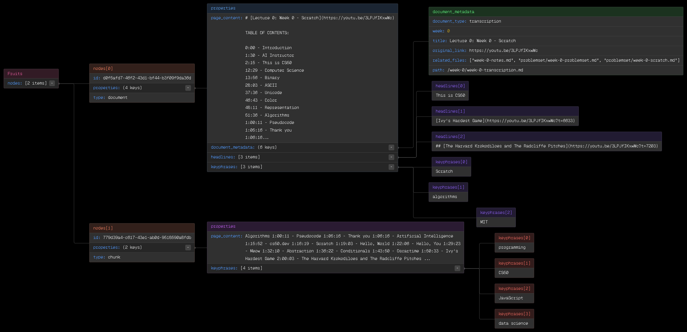
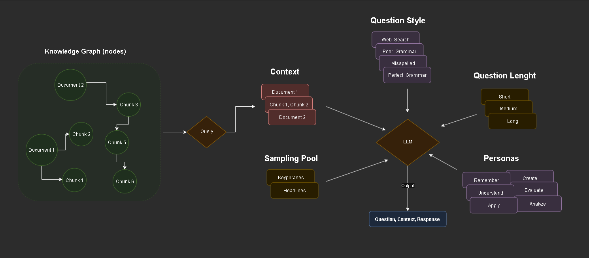
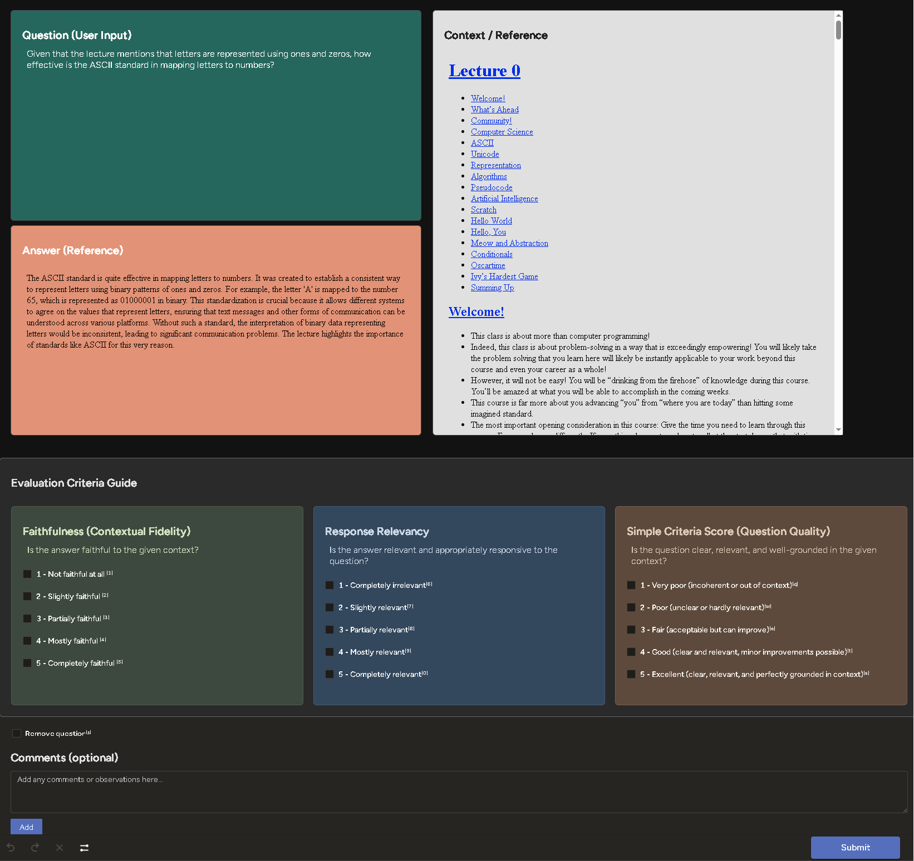
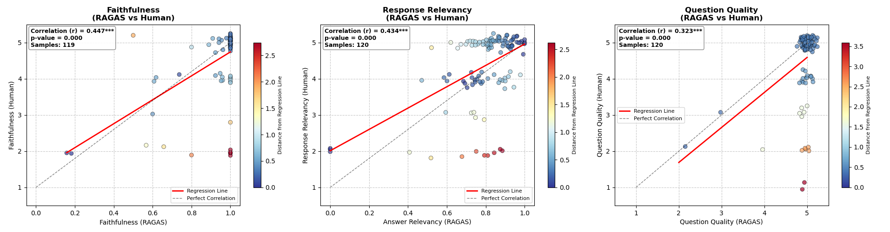
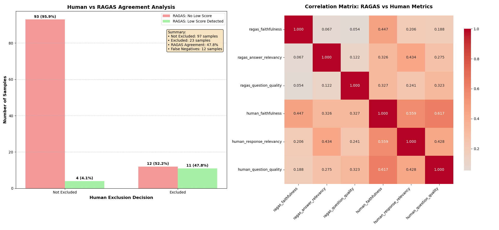
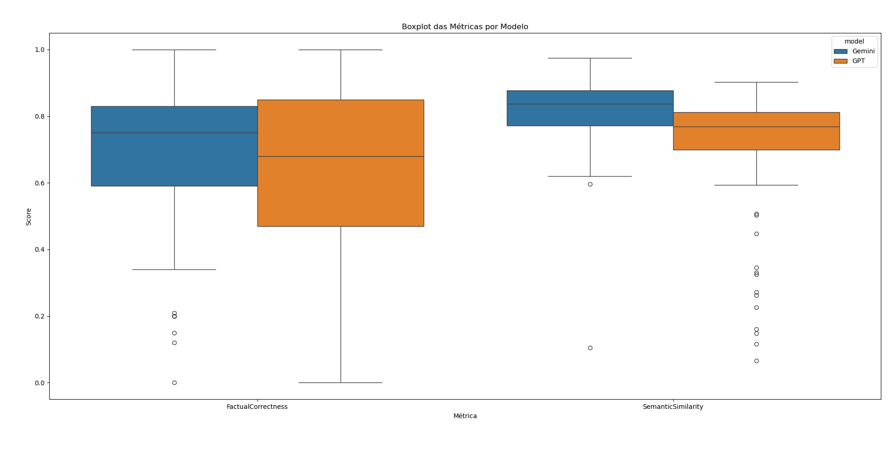
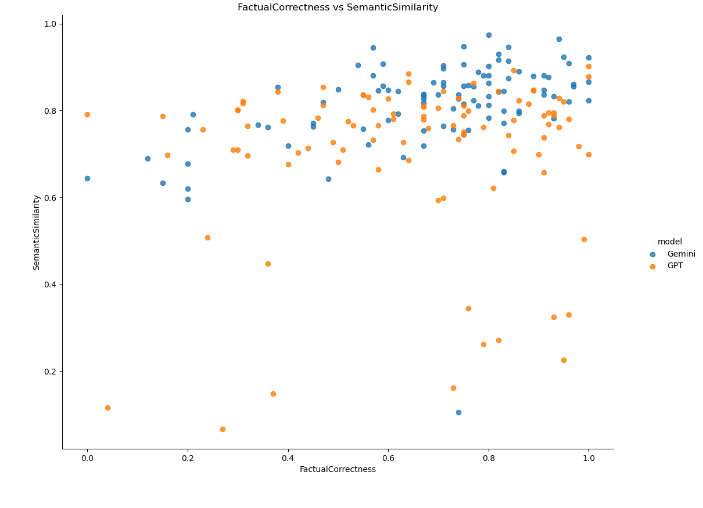

# A Data-Driven Framework for RAG Evaluation in Academic Contexts

This repository contains the implementation of a framework for the systematic generation, processing, and evaluation of synthetic Question-Answering (QA) datasets. This work is part of an academic research initiative aimed at developing rigorous evaluation methodologies for Retrieval-Augmented Generation (RAG) systems applied to specialized domains, such as educational content.

## Motivation

The evaluation of RAG systems often relies on generic benchmarks that may not adequately capture the nuances of specific domains. This research addresses the need for a reproducible and scientifically grounded methodology to create and validate domain-specific evaluation datasets. The primary data source used for developing and testing this framework is the lecture transcripts from Harvard's CS50, a comprehensive introductory course in computer science. Our goal is to provide a reliable process to assess the performance of RAG systems in an educational context.

## Framework Methodology

### 1\. Synthetic Data Generation via Knowledge Graphs

The pipeline ingests raw course materials (transcripts from CS50 lectures) and transforms them into a structured Knowledge Graph. This graph serves as an interconnected data source, mapping relationships between documents and their constituent content chunks, as detailed in Figure 1. The overall architecture for data generation is depicted in Figure 2, outlining the flow from the knowledge graph to the final QA pair.


Detailed view of the Knowledge Graph structure, showcasing interconnected nodes (documents and chunks) with their respective properties and metadata.


Architecture of the synthetic data generation pipeline, from the Knowledge Graph to the final Question-Context-Response triplet.

To ensure pedagogical diversity, question generation is guided by distinct user personas derived from Bloom's Taxonomy. This approach allows for the creation of questions spanning various cognitive levels, from simple recall to complex analysis. Each node within the knowledge graph is enriched with metadata, content, headlines, and keyphrases, enabling a granular and context-aware generation process.

### 2\. Data Processing and Curation

Generated data undergoes a meticulous curation pipeline designed to ensure the quality and statistical integrity of the final evaluation set. The key steps include:

- **Unification**: Aggregating data from multiple generation rounds.
- **Deduplication**: Applying embedding-based filtering to remove semantically redundant questions.
- **Stratified Sampling**: Constructing a final dataset that is statistically representative of the source content, question styles, and cognitive complexity levels.

### 3\. Hybrid Evaluation Protocol

A central component of this research is a dual-validation protocol that combines automated metrics with structured human evaluation. This hybrid approach is designed to validate the reliability of automated metrics for our specific domain.

The human evaluation is conducted using a custom annotation template in Label Studio, shown in Figure 3. This interface standardizes the collection of human judgments, aligning them directly with automated metrics such as Faithfulness, Response Relevancy, and Question Quality from the Ragas library.


Human evaluation interface in Label Studio, designed to capture scores for Faithfulness, Response Relevancy, and Question Quality.

A primary outcome of this protocol is the establishment of a strong, statistically significant correlation between the automated scores and human judgments. The charts in Figure 4 illustrate this positive correlation, supporting the validity of using automated metrics for large-scale evaluation within this framework.


Correlation plots between Ragas automated metrics (Faithfulness, Response Relevancy, Question Quality) and human-provided scores, demonstrating a statistically significant positive correlation.

Further analysis, presented in Figure 5, confirms the high degree of agreement between automated filtering and human decisions for excluding low-quality samples. The correlation matrix provides a comprehensive view of the relationship between all automated and human-evaluated metrics.


Analysis of Human vs. Ragas agreement on sample exclusion (left) and a full correlation matrix between all automated and human metrics (right).

## Installation & Setup

We recommend using Conda for a clean and reproducible environment.

**1. Clone the Repository**

```bash
git clone https://github.com/dev-jonathan/ragas-evaluation.git
cd ragas-evaluation
```

**2. Create & Activate Conda Environment**

```bash
conda create -n ragas-env python=3.10
conda activate ragas-env
```

**3. Install Dependencies**

```bash
pip install -r requirements.txt
```

**4. Configure Environment Variables**

Create a `.env` file in the root directory and add your LLM API keys. These are essential for running the generation and evaluation pipelines.

```
GOOGLE_API_KEY="your_gemini_key_here"
OPENAI_API_KEY="your_openai_key_here"
```

## Project Structure & Documentation

All detailed documentation is organized within the respective subfolders.

- **Source Code (`src/`)**: The core logic and scripts for all pipelines.
  - [Read the full documentation]
- **Data (`data/`)**: All datasets, knowledge graphs, and final artifacts.
  - [Read the full documentation]

## Case Study: Comparative Model Analysis

To demonstrate the framework's utility, a comparative analysis was conducted between two large language models, Gemini and a GPT-based model, operating within the same RAG architecture. The boxplot in Figure 6 shows the score distributions for FactualCorrectness and SemanticSimilarity, highlighting differences in median performance and variance.


Boxplot comparing the performance of Gemini and a GPT-based model on the metrics of Factual Correctness and Semantic Similarity.

A corresponding scatter plot (Figure 7) visualizes the relationship between these two metrics for each model's generated responses, offering deeper insights into their respective performance characteristics.


Scatter plot of Factual Correctness vs. Semantic Similarity for responses generated by each model, illustrating performance profiles.

---

Found a bug or have a suggestion for improving the methodology? Feel free to open an issue or submit a pull request. Contributions to this research are welcome.
